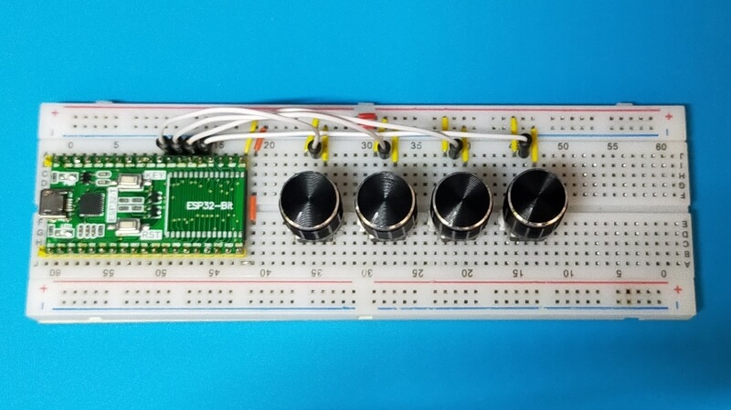
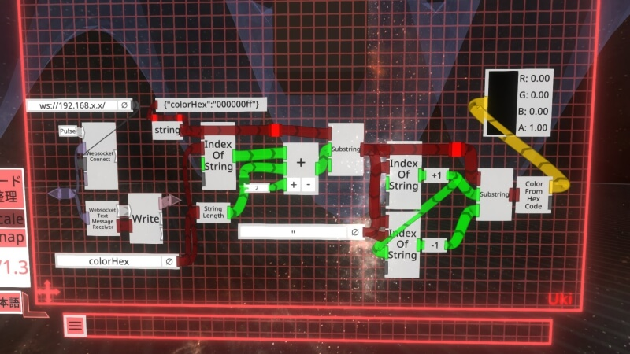

# esp32-ws-send-color

## Overview

'esp32-ws-send-color' uses 'ESP32' to send the analog input RGBA value via WebSocket.  
Here is an example of receiving with 'NeosVR' and acquiring color information.

## Development Environment
### Board
 - ESP-WROOM-32
### Software
- Platformio IDE  
 https://platformio.org/platformio-ide

## Dependencies
- gilmaimon/ArduinoWebsockets@^0.5.3  
  - https://github.com/gilmaimon/ArduinoWebsockets
- arduino-librarie/Arduino_JSON@^0.1.0
  - https://github.com/arduino-libraries/Arduino_JSON

## How to use
- Open src/main.cpp and set the following items correctly.
  - PIN_X
  - SSID
  - PASSWORD

## Contact
https://twitter.com/SLAVR00
